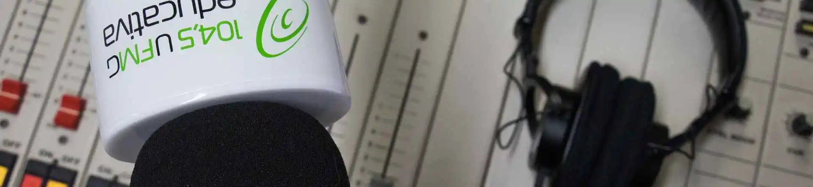
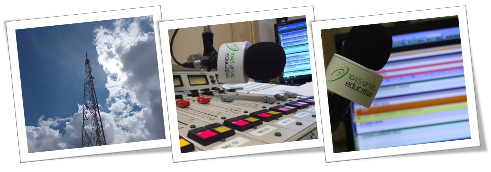

# Rádio UFMG Educativa

## A estação do conhecimento

 A <b>UFMG Educativa</b> é uma rádio pública universitária, fruto da parceria entre a <b>Universidade Federal de Minas Gerais</b> (UFMG) e a <b>Empresa Brasil de Comunicação</b> (EBC), transmitindo 24 horas de programação por dia na freqüência modulada de 104,5MHz para Belo Horizonte e região metropolitana e também pode ser ouvida também pela internet em <a href="https://ufmg.br/comunicacao/radio-ufmg-educativa">radioufmg</a>.
 

 Inaugurada em 6 de setembro de 2005, a emissora oferece uma programação diferenciada e de qualidade que represente uma alternativa aos formatos e gêneros musicais já existentes no mercado e colabore na formação cultural do público.
 

Referência em produção radiofônica entre as rádios universitárias do país, a <b>UFMG Educativa</b> tem a missão de dar visibilidade à produção de conhecimento da Universidade, por meio da comunicação pública da ciência e do fomento à discussão constante de temas relacionados à educação e à cultura. A emissora está vinculada ao Centro de Comunicação da UFMG (Cedecom) e é composta pelos núcleos de Jornalismo, Operações e Programação.

### Siga nossas redes sociais
  

**Released**: 02/07/2021